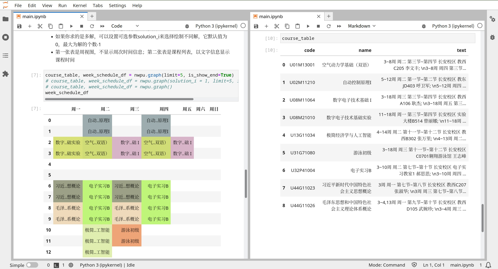

# SelectCourseEasily
根据你提供的课程代码，自动排出可行课表，适用于西工大
## 示例图

## 环境要求
- jupyter
- python 3.10及以上版本  
- 依赖库安装：
  ```bash
  pip install numpy pandas requests lxml gurobipy
  ```
## Features
- 傻瓜式步骤：输入信息，输出课表
- 选课条件：自动过滤不符合选课条件的课程
- 多解：可根据需要列出多个可行的课表
- 自定义规则：支持不选早八、少早八、没有周末课的规则
- 速度：调用gurobipy优化库，极致求解速度，~~仅受限于瓜大服务器带宽~~
- 安全：脚本代码开源，无恶意代码
## 使用步骤
1. 克隆本项目
2. 打开main.ipynb
3. 根据文字提示填写信息，运行求解
4. 喝杯☕，欣赏课表，享受不被琐事耽误的青春时光
## FAQs
- **模拟登陆是如何实现的？为什么需要我的安全邮箱信息？**  
  为得到教务系统的课程信息，程序需要模拟登陆你的教务系统，拿到cookie。翱翔门户目前采用了双因子验证，可以通过安全邮箱获取验证码实现登陆程序，以下是简化的代码逻辑：  
  1. 使用账号、密码（或cookie）尝试登陆翱翔门户
  2. 若密码正确但cookie验证失败，此时申请服务器发送验证码邮件
  3. 使用IMAP协议对邮箱收件箱扫描3次，抓取验证码，随后删除邮件
  4. 发送验证码，完成模拟登陆，将cookie文件保存至本地
- **安全邮箱有什么限制？授权码如何获取？**  
  首先，目前脚本**暂仅支持qq邮箱**；其次，你需要打开qq邮箱的IMAP协议，步骤如下：  
  1. 打开[网页版qq邮箱](https://mail.qq.com)
  2. 找到设置-账户-IMAP/SMTP服务，开启服务
  3. 点击下方的生成授权码
- **使用gurobipy库需要许可证吗？**  
  在不安装许可证的情况下，你可以使用免费版，一般来说能够满足日常需求。你也可以安装对学生免费的教育版，更多信息请参考[Gurobi官网](https://www.gurobi.com/)和[Gurobi中文网](http://www.gurobi.cn/)。
## 最后
本项目仍有诸多不完善之处，欢迎大家通过issue反馈，未来我会抽空不断完善。
